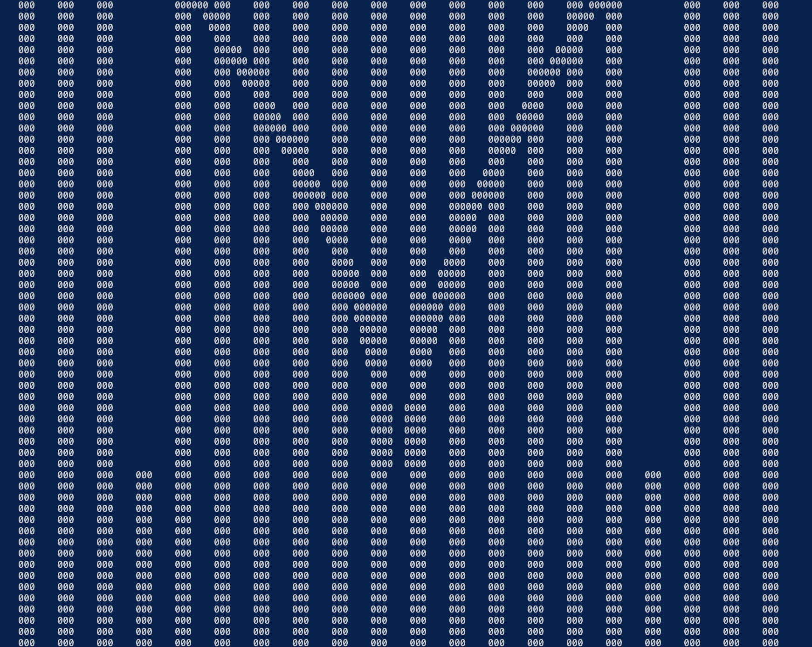
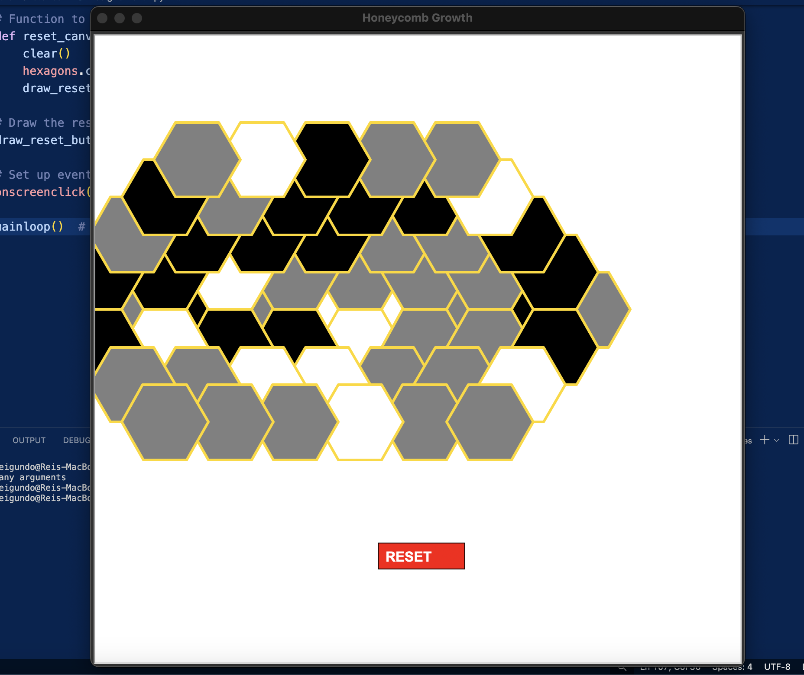
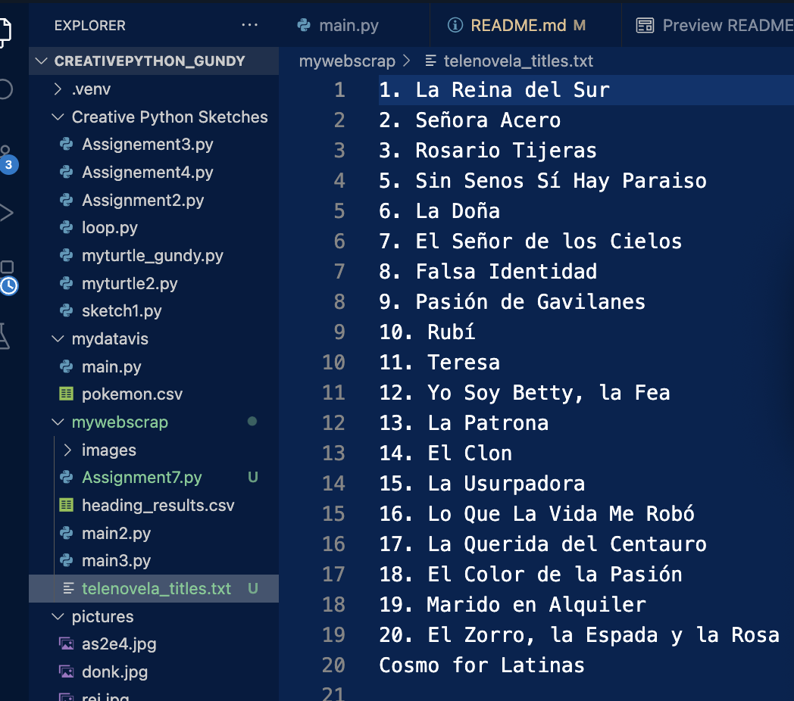

# Creative Coding: PYTHON — Rei Gundy

This repo is where I document my work for **Creative Coding: Python (Spring 2025)**.  
You’ll find:

- 🌈 Data visualization experiments  
- 🧠 Notes and reflections on the philosophy of code  
- 💻 Live code sessions and sketches  

Check out my full creative portfolio here:  
[reigundy.squarespace.com](https://reigundy.squarespace.com)

---

## 📚 Resources I'm Learning From

- [W3Schools Python](https://www.w3schools.com/python/)
- Class materials + tutorials
- Messing around with examples and breaking them

---

## ✅ Assignment 1: Set Up Your GitHub

**Prompt:**  
Create a GitHub repo to hold all your work for this class. Include a README to describe what this is, what you're learning from, and share an image (like a meme or artwork).

**Process:**  
Pretty much what you're looking at now. I set up the repo, structured the README, and started linking both my creative process and resources I’m drawing from.

✅ *Done and done.*

---

## 🎨 Assignment 2: Recreate an Artwork with py5

**Prompt:**  
Choose an artwork you vibe with — poster, pattern, portrait, etc. — and try to recreate it using `py5`. You can use shapes like `ellipse()`, `rect()`, `triangle()`, etc. Add your own twist — randomness, interactions, mouse input, whatever.

**Process:**  
I took a bold, abstract composition and rebuilt it using layered shapes and color. The piece includes:

- Arcs and ellipses mimicking facial structure and abstract forms  
- Triangles and rectangles for shape variation and geometry  
- Mouse interactions that affect small circle elements to give it life  

**Code:**  
> You can find the full sketch [here in this repo](./Creative%20Python%20Sketches/Assignment2.py)

**Sketch Preview:**  
  
Generated with py5 – includes randomness and live mouse tracking

---

## 🌀 Assignment 3: Scroll Art Remix

**Prompt:**  
Pick a scroll art piece from [The Scroll Art Museum](https://scrollart.org/), study the code, and remix it by changing variables, characters, and conditionals. Try to understand what’s happening, mess it up, break it, and see what comes out the other side. Credit your source!

**Process:**  
I remixed the **Twists** scroll art piece by Al Sweigart. I started by reading the original code, then slowly made tweaks to see how each piece affected the visuals. I focused on shifting the spacing and speed of the twisting columns, tried to break the logic, and learned how each loop tied into the animation. It helped me understand how terminal-based animations can feel alive just through character shifts and timing.

**Modifications I made:**
- Changed the twist delay and spacing  
- Tweaked the math controlling the sine wave offset  
- Observed how characters flowed and reset  

**Credit:**  
“Twists” by Al Sweigart  
[GitHub source code](https://github.com/asweigart/scrollart/blob/main/python/twists.py)

**Code:**  
> You can find the full sketch [here in this repo](./Creative%20Python%20Sketches/Assignment3.py)

**Sketch Preview:**  
  
Generated in terminal using character columns and sine-based animations

---

## 🐢 Assignment 4: Geometric Art with Turtle

**Prompt:**  
Create a piece using `turtle` that’s inspired by a pattern, layout, or geometric artwork. Could be something like a barcode, architectural sketch, or even a tessellation. Expand it with color, interactivity, randomness.

**Process:**  
This piece is an interactive **hexagon growth grid** — inspired by natural structures like beehives or modular urban layouts. I used turtle to build a function that draws a hex, then connected new ones to its neighbors. It builds out from your click, but only if there's a valid neighbor to attach to. Plus I added a custom reset button at the bottom.

**What I tried:**
- Calculating hexagon positions with math  
- Making sure hexes only grow in valid adjacent spots  
- Adding randomness to fill color  
- Drawing and wiring up a real “RESET” button  

**Code:**  
> You can find the full sketch [here in this repo](./Creative%20Python%20Sketches/Assignment4.py)

**Sketch Preview:**  
  
Created with Turtle – interactive click-to-grow hex grid + reset button

---

## 🎮  Assignment 5: Game Design
---

## 🧬 Assignment 6: Pokémon Stats Visualization

**Prompt:**  
Pick a dataset and explore it visually by asking 1–3 guiding questions. This could focus on rankings, comparisons between groups, or exploring relationships between variables.

**Dataset Chosen:**  
[`pokemon.csv`](./assignment5/pokemon.csv) — a dataset of 800+ Pokémon including their types and stats like Attack, Defense, and Speed.

**Guiding Questions:**
1. **Who are the top 10 Pokémon by Speed?**  
2. **How does Attack vary across different Pokémon Types?**  
3. **Is there any visible relationship between Attack and Defense?**

**What I learned:**
- Grouping and sorting with `pandas` makes comparative visualizations really intuitive  
- Using `plotly` subplots helped combine multiple questions into one dashboard  
- Mapping Pokémon Types to unique colors made patterns more visually distinct  

**Visualizations included:**
- Bar chart of **Top 10 Attack Pokémon per Type**  
- **Scatter plot** comparing Attack vs Defense  
- **Top 10 Fastest Pokémon** by Speed  

**Code:**  
> You can find the full sketch [here in this repo](./mydatavis/main.py)

**Sketch Preview:**  
  
Generated with Plotly – includes grouped bar charts and scatter plot analysis

---

## 🕸️ Assignment 7: Web Scraping — Telenovela Time

**Prompt:**  
Practice web scraping on a site you’re interested in or contains info for your research. Scrape paragraphs, headings, or images. Document your code, your process, and any errors. Save results to CSV or screenshot your image folder. Submit with your code and README.

**What I Tried First (The Chaos):**  
I started with a list on IMDB — [Top Telenovelas of All Time](https://www.imdb.com/list/ls004944935/). Looked perfect, *felt* perfect… until I got hit with a **504 error** (might’ve been 503 tbh, trauma blocked it). After some digging (aka Googling like a maniac), I realized **IMDB doesn't allow scraping**. They’ve got a whole **robots.txt** file that blocks bots like mine. I’ll admit it, I got humbled by a text file. LMAO.

**What I Did Instead (The Recovery Arc):**  
I pivoted to [Cosmopolitan’s telenovela list](https://www.cosmopolitan.com/entertainment/tv/news/a31651/10-best-novelas-of-all-time/) — and boom, success. I used `requests` and `BeautifulSoup` to scrape the H2 headers (which contained the novela titles), printed them to the console, and saved them to a `.txt` file.

**Code Highlights:**
- Checks response status to avoid scraping fails  
- Uses `soup.select('h2')` to find novela titles  
- Writes scraped data to a `.txt` file for easy access

**Code:**  
> You can find the full code [here in this repo](./mywebscrap/Assignment7.py)

**Scrape Preview:**  
  
Scraped titles printed in terminal and saved to text

✅ *Scraped, saved, and survived.*

---